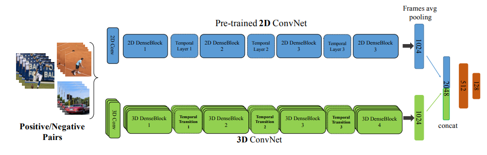

# T3D-keras
A Temporal 3D for action recognition in videos




This code is written in **keras** for transfer learning as described in the paper.

**[Temporal 3D ConvNets: New Architecture and Transfer Learning for Video Classification](https://arxiv.org/abs/1711.08200)**,
<br>
[Ali Diba\*](http://alidiba67.github.io/),
[Mohsen Fayyaz\*](http://mohsenfayyaz89.github.io/),
[Vivek Sharma](http://vivoutlaw.github.io/),
[Amir Hossein Karami](http://www.sensifai.com),
[Mohammad Mahdi Arzani](http://www.sensifai.com),
[Rahman Yousefzadeh](http://www.sensifai.com),
[Luc Van Gool](https://ic.epfl.ch/page-62394-en.html)
<br>

Original code for this paper is written in **PyTorch**, [here](https://github.com/MohsenFayyaz89/T3D)

```
@ARTICLE{2017arXiv171108200D,
   author = {{Diba}, A. and {Fayyaz}, M. and {Sharma}, V. and {Karami}, A.~H. and 
	{Mahdi Arzani}, M. and {Yousefzadeh}, R. and {Van Gool}, L.},
    title = "{Temporal 3D ConvNets: New Architecture and Transfer Learning for Video Classification}",
  journal = {ArXiv e-prints},
archivePrefix = "arXiv",
   eprint = {1711.08200},
 primaryClass = "cs.CV",
 keywords = {Computer Science - Computer Vision and Pattern Recognition},
     year = 2017,
    month = nov,
   adsurl = {http://adsabs.harvard.edu/abs/2017arXiv171108200D},
  adsnote = {Provided by the SAO/NASA Astrophysics Data System}
}

```

### Dataset
[UCF50](http://crcv.ucf.edu/data/UCF50.rar) video dataset was used
